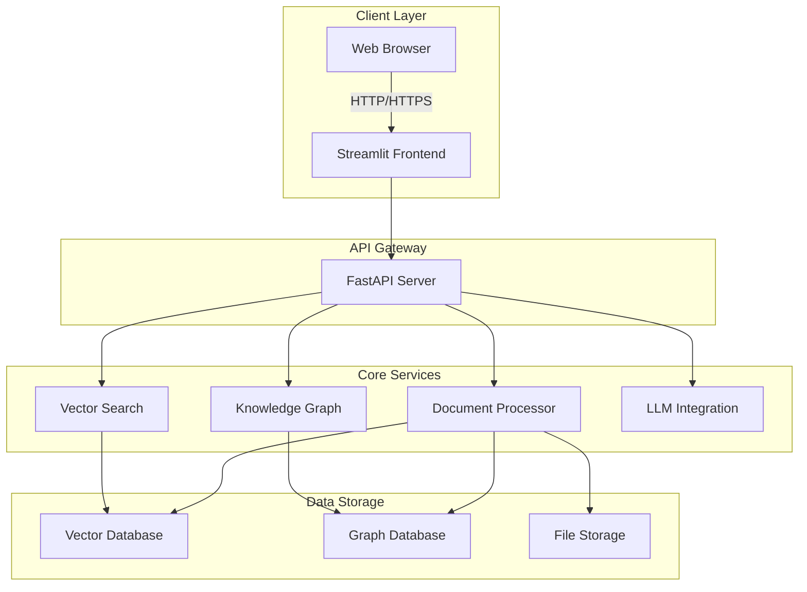
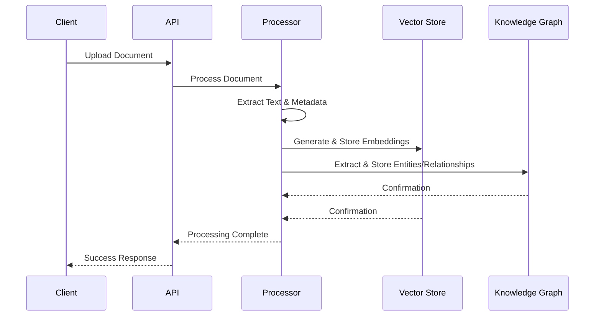
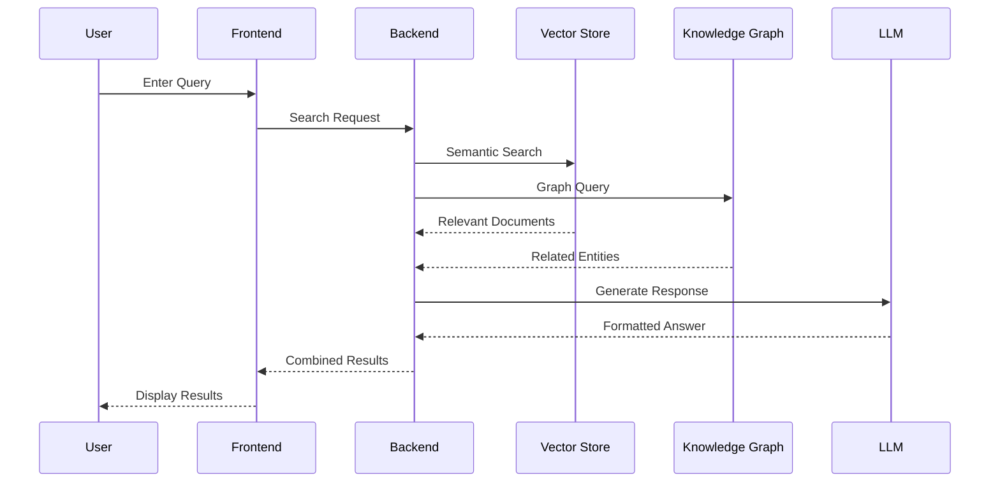

# CosmicSpark Architecture & Data Flow

## System Overview

CosmicSpark is built on a modern microservices architecture with clear separation of concerns between components. The system is designed for scalability, maintainability, and extensibility.

## High-Level Architecture

## Component Details

### 1. Frontend (Streamlit)
- **Purpose**: User interface for interacting with the system
- **Technologies**: Streamlit, Plotly, NetworkX
- **Responsibilities**:
  - User authentication and session management
  - Query input and result visualization
  - Knowledge graph visualization
  - Document upload and management

### 2. API Gateway (FastAPI)
- **Purpose**: Central entry point for all client requests
- **Technologies**: FastAPI, Uvicorn, Pydantic
- **Endpoints**:
  - `/api/search` - Document and entity search
  - `/api/documents` - Document management
  - `/api/knowledge` - Knowledge graph operations
  - `/auth/*` - Authentication endpoints

### 3. Document Processor
- **Purpose**: Process and index incoming documents
- **Technologies**: spaCy, NLTK, PyPDF2
- **Pipeline**:
  1. Text extraction
  2. Document chunking
  3. Entity recognition
  4. Relationship extraction
  5. Metadata generation

### 4. Vector Search
- **Purpose**: Semantic search and retrieval
- **Technologies**: ChromaDB, Sentence Transformers
- **Features**:
  - Dense vector indexing
  - Hybrid search (BM25 + Dense)
  - Result reranking

### 5. Knowledge Graph
- **Purpose**: Store and query relationships between entities
- **Technologies**: Neo4j, NetworkX
- **Features**:
  - Entity resolution
  - Relationship inference
  - Graph traversals
  - Community detection

### 6. LLM Integration
- **Purpose**: Natural language understanding and generation
- **Technologies**: Ollama, Transformers
- **Capabilities**:
  - Query understanding
  - Response generation
  - Summarization
  - Question answering

## Data Flow

### Document Ingestion

### Search Flow

## Scalability Considerations

### Horizontal Scaling
- **API Layer**: Stateless design allows for easy scaling
- **Vector Store**: Sharding and replication support
- **Knowledge Graph**: Read replicas for query load distribution

### Caching Strategy
- **Redis** for session management
- **Query result** caching
- **Embedding** cache for frequent queries

### Data Consistency
- **Eventual consistency** for search indices
- **ACID transactions** for knowledge graph updates
- **Periodic synchronization** between vector store and knowledge graph

## Security Considerations

### Authentication & Authorization
- JWT-based authentication
- Role-based access control (RBAC)
- API key management

### Data Protection
- Encryption at rest and in transit
- Regular security audits
- Input validation and sanitization

## Monitoring & Observability

### Logging
- Structured logging with log levels
- Request/Response logging
- Error tracking

### Metrics
- API response times
- Resource utilization
- Error rates
- Query performance

### Alerting
- Anomaly detection
- System health alerts
- Performance degradation alerts

## Future Enhancements

1. **Multi-modal Support**
   - Image and video processing
   - Audio transcription
   - Multi-modal embeddings

2. **Advanced Analytics**
   - Trend analysis
   - Anomaly detection
   - Predictive modeling

3. **Collaboration Features**
   - Shared workspaces
   - Annotation tools
   - Version control for documents

4. **Deployment Options**
   - Kubernetes support
   - Serverless deployment
   - Edge deployment for offline capabilities
