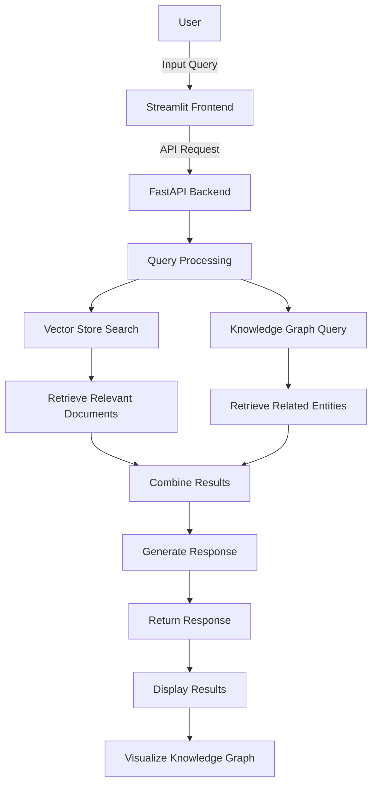
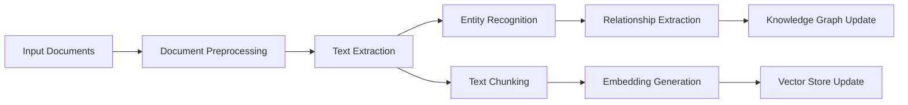
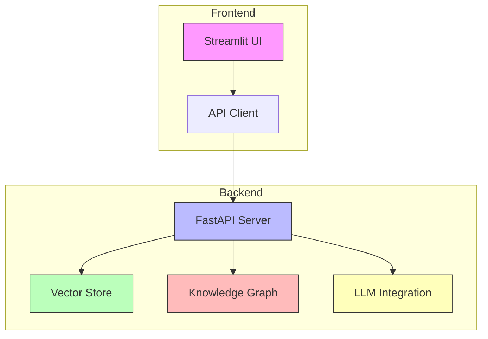
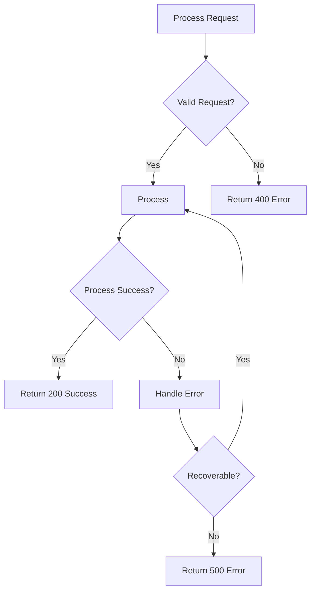
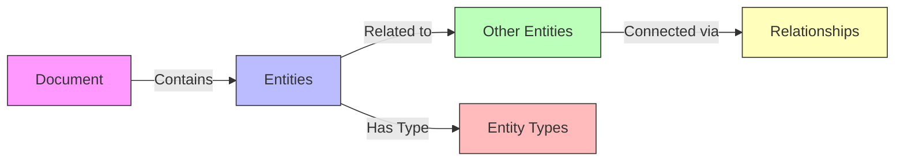
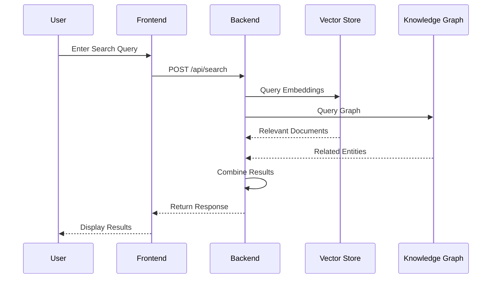
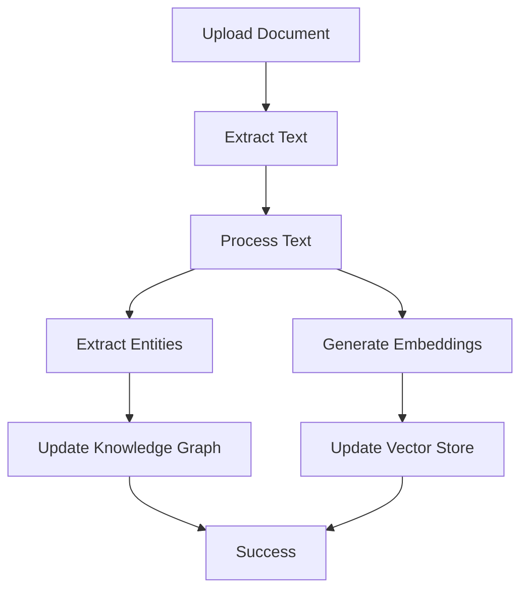
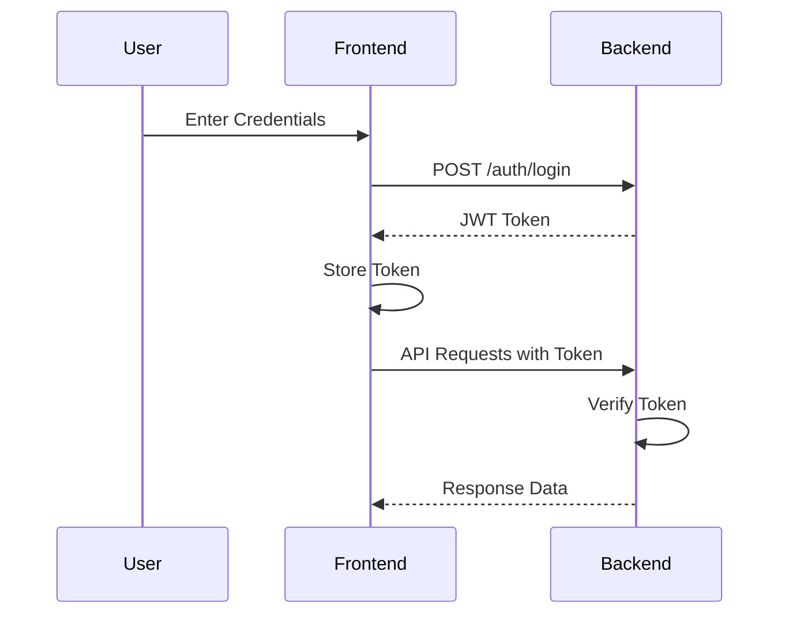

# CosmicSpark Visual Flow

## User Interaction Flow

## Data Processing Pipeline

## System Architecture

## Error Handling Flow

## Knowledge Graph Visualization

## Search Flow

## Document Ingestion Flow

## Authentication Flow

